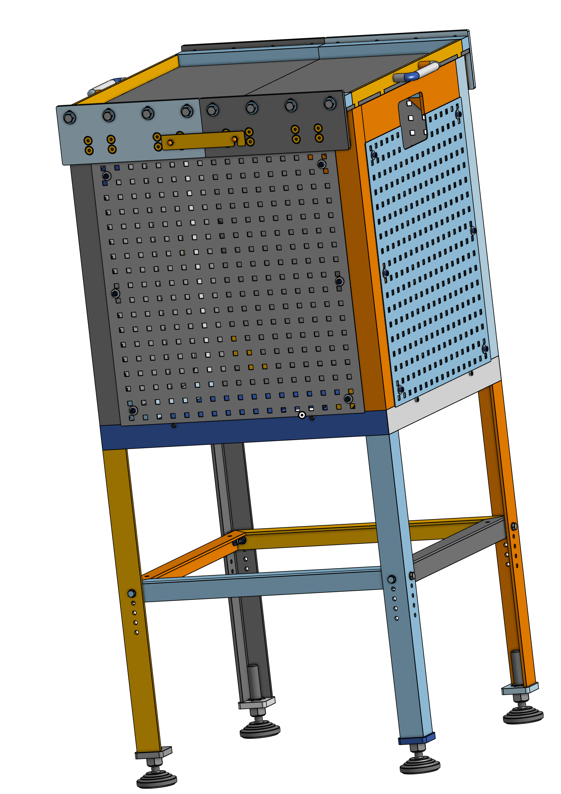

# Housing of online gamma-measurement chamber (steel type)

This repository contains the construction drawings, CAD models for housing which holds steel bricks as shielding and a water chamber to use with NaI(Tl) detectors for online gamma-ray measurements. The repository contains each part.

This device is designed to stand in a measurement station and is usually equipped with steel bricks and a PE measurement chamber. The total weight with steel bricks is up to 1000 kg. Therefore the chosen material (e.g. stainless steel and dimensions have to be chose carefully and confirmed by professional metalworkers.
The main difference between the steel and lead type housing is the size. To achieve the same amount of shielding steel bricks are thicker. Therefore, holding the same measurement chamber the housing has to be larger.

## 3D Preview & Design
Click the image below to open the **interactive 3D viewer** and inspect the STL model.

<i>Click for preview.</i>

*Click the image to rotate and zoom the model in 3D.*
