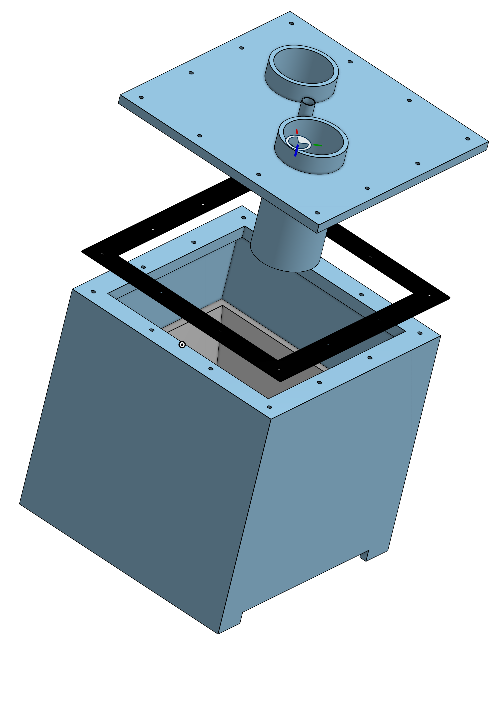

# Measurment chamber

This repository contains the construction drawings, CAD models for the measurment chamber which holds river water and the NaI(Tl) sensor. The chamber is placed inside the metal housinf and the steel/lead brick wall.
The repository contains each part.

This chamber is attached to river water und pressure and must be pressuretight. The chamber is sealed using and EPDM Seal and tightend with threaded rods and wingnuts. 

## 3D Preview & Design
Click the image below to open the **interactive 3D viewer** and inspect the STL model.

<i>Click for preview.</i>

*Click the image to rotate and zoom the model in 3D.*
