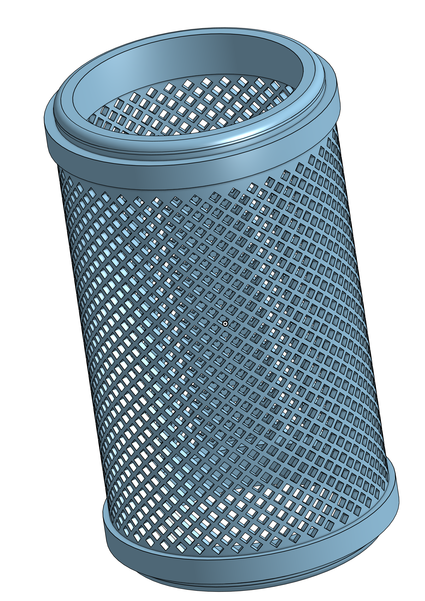

# 2mm Filter for Gardena pre filter

This repository contains the construction drawings, CAD models* for replacement filter for Gardena Artikel-Nr. 1731-20 pre pumpe filter 3000 l/h.

The filter has a an grid size of 2 mm and is meant do be 3d printed

## 3D Preview & Design
Click the image below to open the **interactive 3D viewer** and inspect the STL model.

<i>Click for preview.</i>

*Click the image to rotate and zoom the model in 3D.*
