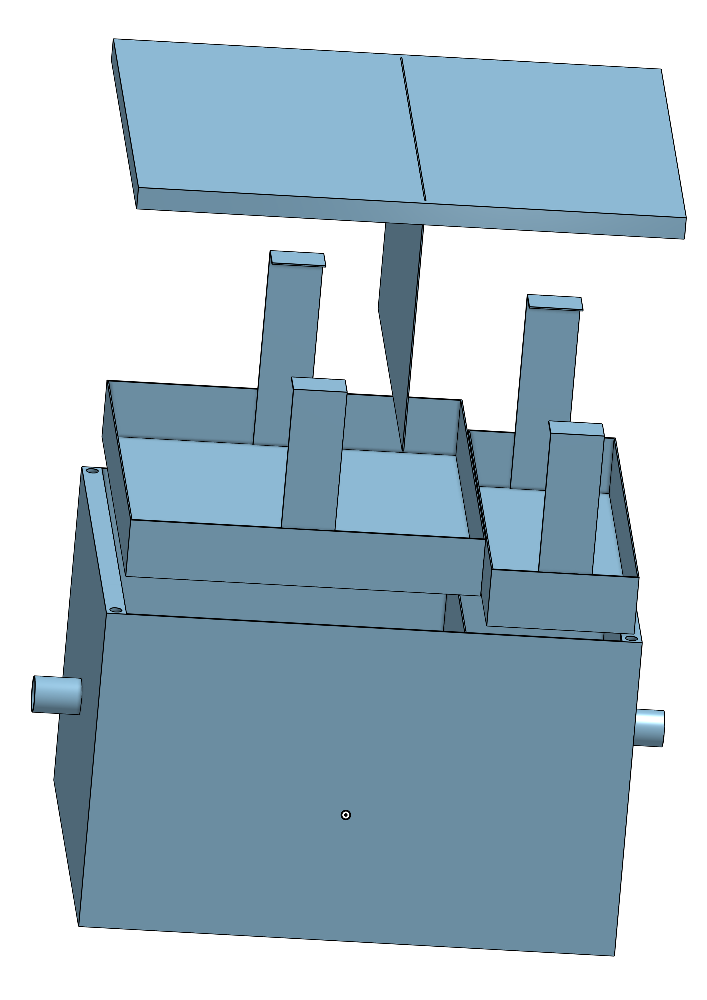

# Suspended matter collector type 2 chamber inside

This repository contains the **construction drawings, CAD models* for a mechanical Suspended Matter Collector. The repository contains each part as well as the assembly and construciton drawings

This device is designed to stand in a measurement station and be connected to an activly pumped river water line. The water is discharge via a free flow drain. Inside the cahmber the water is lowed down and has to move passed baffle plates where it can sediment into the trays. The construction material used is stainless steel. At the BfG it is used for collecting samples for the [Umweltprobenbank](www.umweltprobenbank.de)

## 3D Preview & Design
Click the image below to open the **interactive 3D viewer** and inspect the STL model.

<i>Click for preview.</i>

*Click the image to rotate and zoom the model in 3D.*
