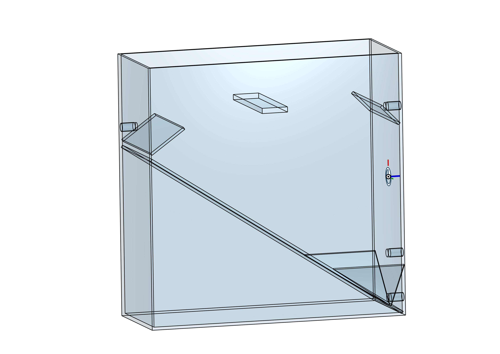

# Suspended matter collector type "Elbsammler"

This repository contains the construction drawings, CAD models for a mechanical Suspended Matter Collector. The repository contains each part as well as the assembly and construciton drawings

This device is designed to stand in a measurement station and be connected to an activly pumped river water line. The water is discharge via a free flow drain.
The construction material can be translucent (Acryl) or opaque (PVC, PE). This type is mainly used at the Elbe river, hence the name Elbsammler

## 3D Preview & Design
Click the image below to open the **interactive 3D viewer** and inspect the STL model.

<i>Click for preview.</i>

*Click the image to rotate and zoom the model in 3D.*
