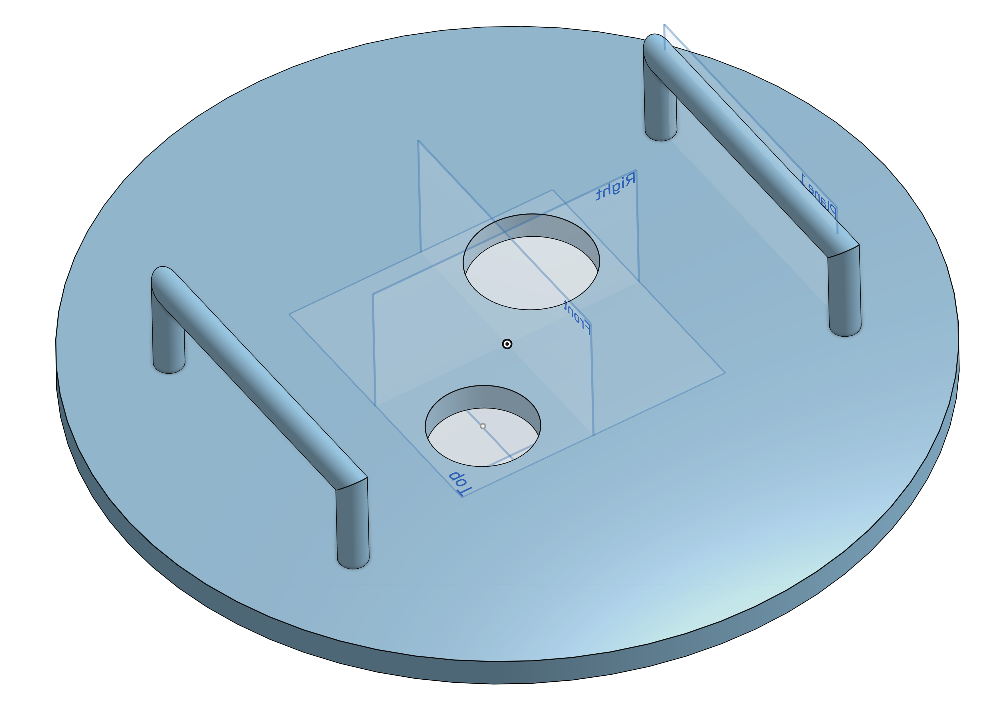

# Suspended matter collector type "G4 Sammpler"

This repository contains the **construction drawings, CAD models* for a mechanical Suspended Matter Collector. The repository contains each part as well as the assembly and construciton drawings

This is an alternatice lid for the G4 Sammpler, which can hold Sensors.
The construction material should be PVC or on our usecase black PE. This type is mainly used at environmental radiology monitoring stations where we need extra sensor mountings.

## 3D Preview & Design
Click the image below to open the **interactive 3D viewer** and inspect the STL model.

<i>Click for preview.</i>

*Click the image to rotate and zoom the model in 3D.*
